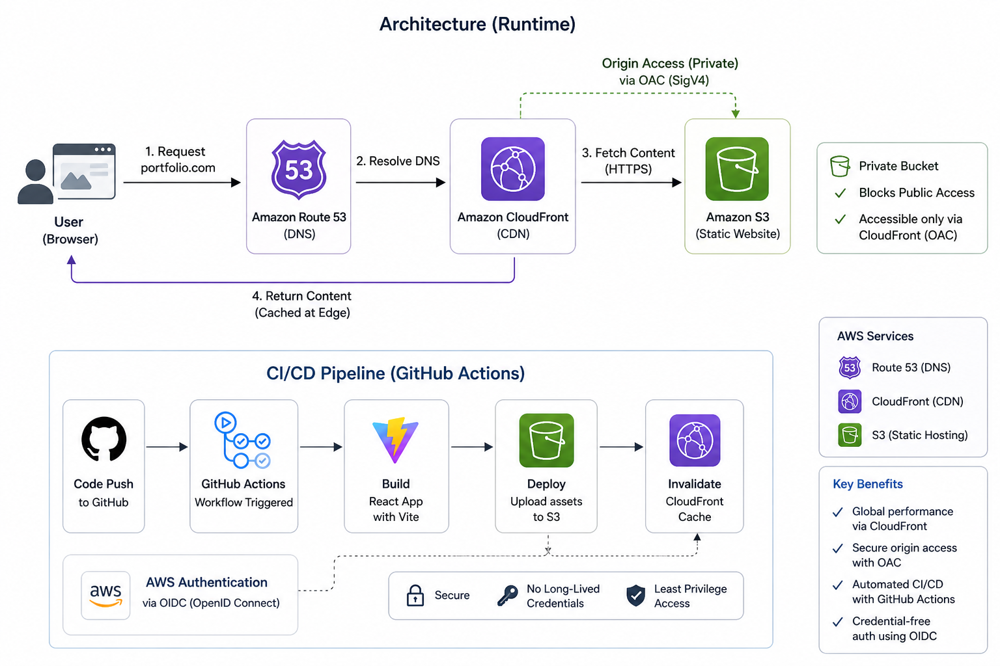

# Portfolio Website

A React single-page application built with Tailwind and Vite, deployed on AWS using a fully automated CI/CD pipeline. You can view it [here](https://gabrielwelvaert.com/).

## Architecture

This React SPA is hosted on a private S3 bucket, delivered through CloudFront, and routed with Route 53. CloudFront uses Origin Access Control (OAC) so the bucket is only accessible through the CDN.

  

## CI/CD

Deployments are automated with GitHub Actions. The workflow builds the Vite app, uploads assets to S3, invalidates the CloudFront cache, and authenticates to AWS using OIDC instead of long-lived credentials.
