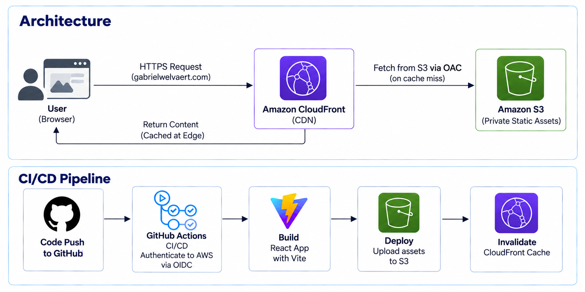

# Portfolio Website

Single-page React application built with Tailwind and Vite, hosted in a private S3 bucket and delivered through CloudFront. CloudFront accesses the S3 origin through Origin Access Control (OAC), while GitHub Actions deploys by assuming an AWS IAM role through OpenID Connect (OIDC). Route 53 manages DNS for gabrielwelvaert.com. You can view it [here](https://gabrielwelvaert.com/).

  

